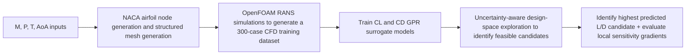
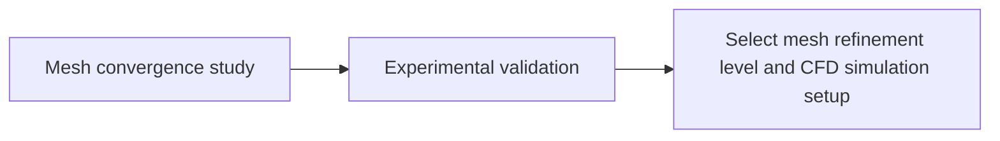
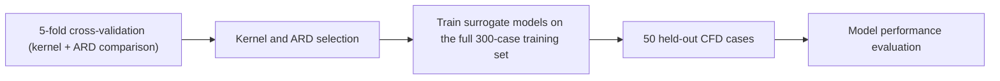
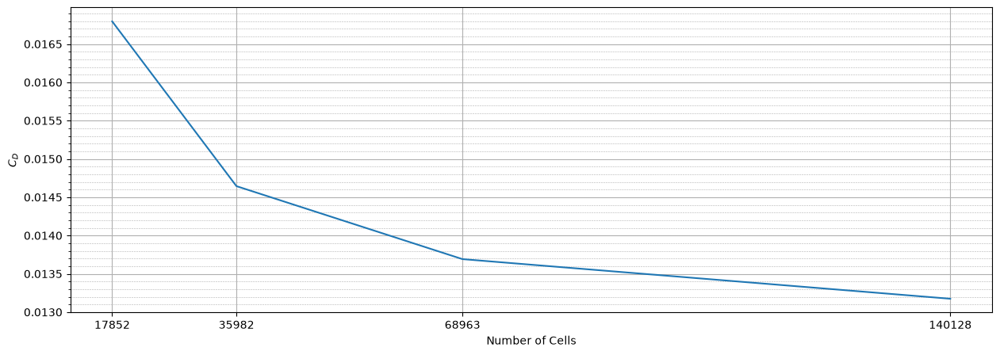
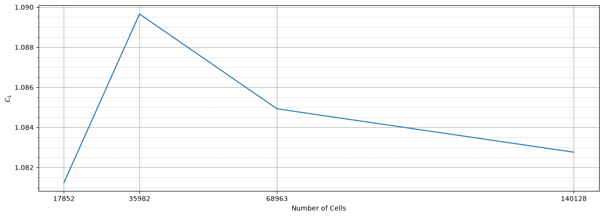
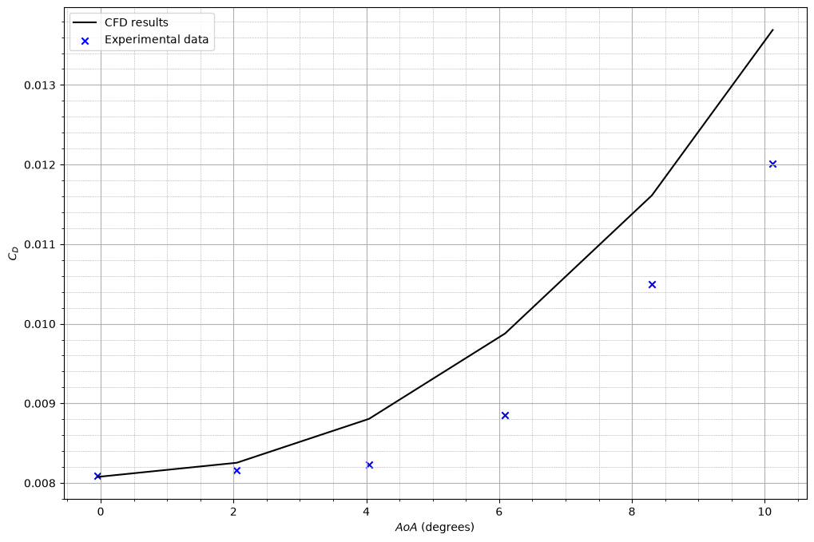
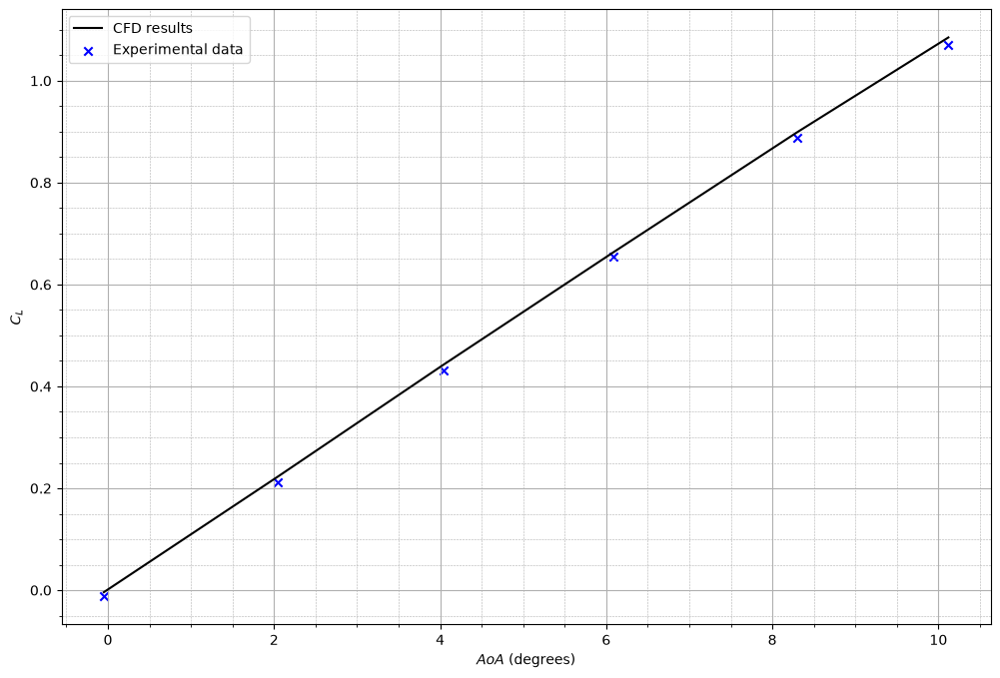
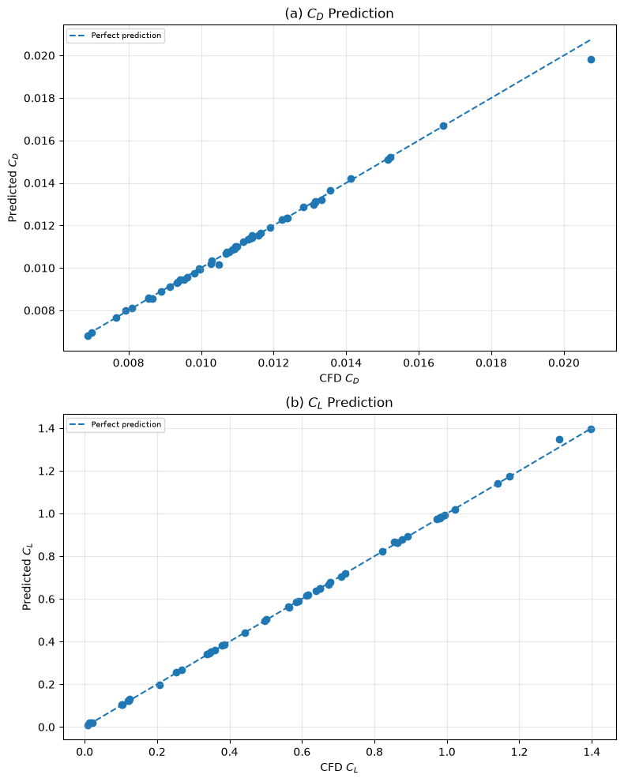
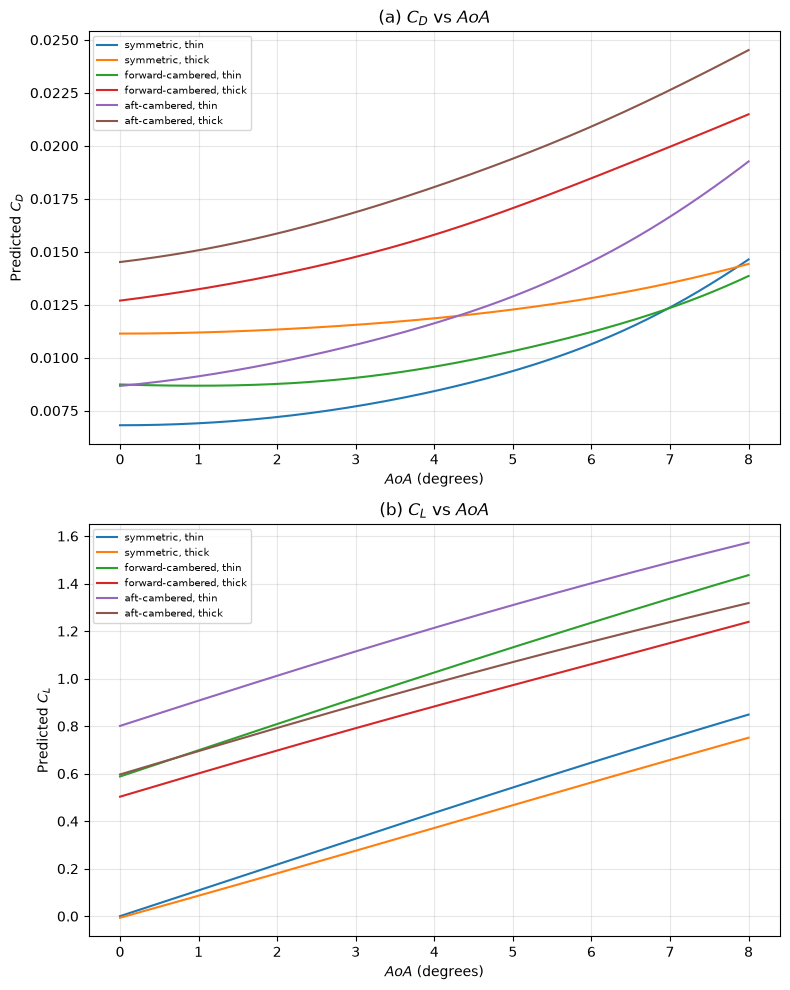

# CFD-ML Pipeline for Design Space Exploration of NACA 4-digit Airfoils

## Overview

Engineering often involves selecting the optimal configuration from a continuous design space where evaluating every candidate is impractical. NACA 4-digit airfoils provide a well-defined, parametric case study to develop a pipeline capable of systematic exploration of the design space. In this project, angle of attack ($AoA$) is the only variable defining the operating condition while Reynolds number is fixed at $6 \times 10^6$. Since the geometry of a NACA 4-digit airfoil can be fully defined by three parameters — maximum camber ($M$), maximum camber position ($P$), and maximum thickness ($T$) — the goal is to develop a surrogate model to approximate the CFD response from the four input parameters, predicting coefficients of lift ($C_L$) and drag ($C_D$).

To achieve the project objective, an automated CFD-to-ML pipeline was built. Python and the Gmsh API were used for parametric geometry generation and structured mesh generation. Mesh convergence studies were performed by comparing $C_L$ and $C_D$ predictions at different mesh refinement levels, and the CFD predictions were also validated against published experimental data. Fully turbulent RANS simulations were then performed in OpenFOAM, producing 300 CFD cases to construct the training dataset. Two surrogate models were then trained using Gaussian process regression to predict $C_L$ and $C_D$ with predictive uncertainty. Model performance was evaluated on 50 held-out CFD cases.

With fully trained models, rapid exploration throughout the defined design space is possible without running new CFD simulations. Engineers can impose constraints on the required aerodynamic performance, and feasible design points can be quickly identified while accounting for predictive uncertainty. The highest predicted lift-to-drag ($L/D$) configuration is identified, while allowing users to select another feasible configuration with additional geometric constraints. Sensitivities of aerodynamic performance metrics to design parameters, represented by gradients, provide insight for further design refinement.

## Workflow

### Main Pipeline



### CFD Convergence and Validation



### ML Model Selection and Validation



## CFD Methodology

### Geometry Generation and Meshing

NACA 4-digit airfoil coordinates were generated parametrically in Python from $M$, $P$, and $T$ using the standard equations described by [AirfoilTools](http://airfoiltools.com/airfoil/naca4digit). These generated airfoil nodes were then used to define the airfoil geometry in a Gmsh `.geo` script for structured mesh generation. To accurately resolve the near-wall flow, which is particularly important for $C_D$ prediction, a boundary layer mesh with a first layer height of $5 \times 10^{-6}\ m$ is generated around the airfoil to achieve a $y^+$ target of 1. Subsequently, a structured C-mesh is generated from the boundary layer mesh into the farfield. The C-mesh is rotated about the airfoil according to the specified $AoA$ to maximise cell flow alignment. Using the Gmsh API in Python, the `.geo` script is run to generate a `.msh` file for subsequent use in OpenFOAM.

The resulting geometry generation and meshing tool requires only the geometry parameters ($M$, $P$, and $T$), flow condition ($AoA$), mesh refinement level, and farfield extension distance. This automated pipeline ensures that the mesh of any arbitrary airfoil within the design space can be generated without manual remeshing.

### CFD Setup

OpenFOAM v2412 was used to perform CFD simulations. Fully turbulent RANS simulations were performed under steady-state, incompressible, 2D conditions, using a $k-\omega$ SST turbulence model. At a freestream flow speed of Mach ($Ma$) 0.15, compressibility effects are sufficiently small for an incompressible flow assumption to be appropriate. At a Reynolds number of $6 \times 10^6$, a fully turbulent assumption was adopted. The maximum $AoA$ was limited to $8 ^\circ$ to reduce the likelihood of strongly separated and unsteady flows, supporting the use of steady-state simulations within the design space. These assumptions, together with the 2D approximation, allow aerodynamic performance of airfoils to be evaluated while keeping computational costs of generating the CFD datasets manageable within the available resource constraints.

With temperature $T = 300\ K$, heat capacity ratio $\gamma = 1.4$, and specific gas constant $R = 287\ J\,kg^{-1}K^{-1}$, speed of sound ($c$) was evaluated by
$$
c = \sqrt{\gamma R T} = 347.19\ m\,s^{-1}.
$$
At Mach 0.15, flow speed ($U$) was
$$
U = Ma \times c = 52.0783\ m\,s^{-1}.
$$
Since all airfoils generated had a chord length ($L$) of $1\ m$ and simulations were conducted at Reynolds number $6 \times 10^6$, kinematic viscosity ($\nu$) was calculated using
$$
Re = \frac{UL}{\nu},
$$
resulting in
$$
\nu = 8.67972 \times 10^{-6}\ m^2\,s^{-1}.
$$
Freestream turbulence conditions were derived from [NASA Turbulence Modeling Resource (TMR) NACA 0012 SST validation case](https://tmbwg.github.io/turbmodels/naca0012_val_sst.html), using a turbulence intensity ($I$) of 0.052% and a turbulent-to-laminar viscosity ratio ($\nu_t/\nu$) of 0.009 to evaluate the freestream turbulent kinetic energy ($k$) and specific dissipation rate ($\omega$). As a result,
$$
k = \frac{3}{2} (UI)^2 = 1.10005 \times 10^{-3}\ m^2\,s^{-2}
$$
and
$$
\omega  = \frac{k}{\frac{\nu_t}{\nu} \nu} = 1.40820 \times 10^4\ s^{-1}.
$$

In the `simpleFoam` setup, farfield boundary conditions for $U$ and pressure ($p$) were `freestream` and `freestreamPressure`, while $k$ and $\omega$ used `inletOutlet` farfield boundary conditions to represent freestream flow conditions. Turbulent kinematic viscosity ($\nu_t$) used a `calculated` farfield boundary condition, as it is determined by the turbulence model. At the airfoil surface, `noSlip` and `zeroGradient` conditions were applied to $U$ and $p$, while `kqRWallFunction`, `omegaWallFunction`, and `nutLowReWallFunction` were used for the turbulence quantities. These conditions support the low-$y^+$ near-wall treatment used with the $k-\omega$ SST model.

To assess iterative convergence, tolerances of $1 \times 10^{-6}$ and $1 \times 10^{-5}$ were applied to $C_D$ and $C_L$, respectively, over a 200-iteration window. Residuals of $U$ and $p$ were also monitored, with a convergence tolerance of $1 \times 10^{-4}$. All convergence criteria were required to be satisfied before the simulation was stopped.

### Mesh Convergence

A mesh convergence study was performed to assess the sensitivity of aerodynamic coefficients to spatial discretisation. The study was performed on a NACA 0012 airfoil at an $AoA$ of $10.12 ^\circ$, and the resulting $C_D$ and $C_L$ values were plotted against the number of cells. A monotonic decrease in $C_D$ was observed, with a percentage decrease of 3.78% between refinement levels 3 and 4, as shown in Table 1 and Figure 1.

*Table 1: Mesh convergence results based on $C_D$.*
| Refinement Level | Number of Cells | $C_D$ | Change in $C_D$ (%) | Time (s) | Change in Time (%)|
|---|---:|---:|---:|---:|---:|
| 1 | 17,852 | 0.016795 | — | 103 | — |
| 2 | 35,982 | 0.0146442 | -12.81 | 91 | -11.65 |
| 3 | 68,963 | 0.0136913 | -6.51 | 149 | 63.74 |
| 4 | 140,128 | 0.0131742 | -3.78 | 463 | 210.74 |



*Figure 1: Mesh convergence of $C_D$ with increasing cell count.*

From Figure 2, $C_L$ showed an oscillatory response to mesh refinement with a maximum percentage change of only 0.78%. The magnitude of the percentage change decreased monotonically with mesh refinement, reaching 0.20% between refinement levels 3 and 4, as shown in Table 2. $C_L$ was therefore considered to have converged and was considerably less sensitive to mesh refinement than $C_D$.

*Table 2: Mesh convergence results based on $C_L$.*
| Refinement Level | Number of Cells | $C_L$ | Change in $C_L$ (%) |
|---|---:|---:|---:|
| 1 | 17,852 | 1.08123 | — |
| 2 | 35,982 | 1.08966 | 0.78 |
| 3 | 68,963 | 1.08492 | -0.43 |
| 4 | 140,128 | 1.08276 | -0.20 |



*Figure 2: Mesh convergence of $C_L$ with increasing cell count.*

To choose between refinement levels 3 and 4, further investigation was required to assess the additional computational cost associated with increasing mesh refinement and the effect of further mesh refinement on CFD predictions. As a result, an AoA-swept validation study against experimental data was performed at both discretisation levels.

### Experimental Validation

Experimental data for the NACA 0012 airfoil were obtained from the [NASA TMR](https://tmbwg.github.io/turbmodels/naca0012_val.html), which provides the experimental data reported by [Ladson (1988)](https://ntrs.nasa.gov/api/citations/19880019495/downloads/19880019495.pdf). CFD results were compared against experimental data obtained at Mach 0.15 and Reynolds number $5.95 \times 10^6$. The tripped experimental data, obtained with a No. 80 grit strip applied near the leading edge, were used because they provide an appropriate comparison with fully turbulent CFD at a Reynolds number close to the operating value. The [NASA TMR NACA 0012 SST validation case](https://tmbwg.github.io/turbmodels/naca0012_val_sst.html) also uses this experimental dataset for model validation.

From Table 3, the average $C_D$ error at refinement level 3 was 7.42%, while the maximum error reached 14%. Since $C_D$ was predominantly overestimated, as shown in Figure 3, a maximum drag constraint would tend to produce conservative feasibility filtering.

*Table 3: Validation results for $C_D$ at refinement level 3.*
| $AoA$ | CFD | Experimental | Absolute Error | Relative Error (%) |
|---:|---:|---:|---:|---:|
| -0.05 | 0.00807548 | 0.00809 | $1.45 \times 10^{-5}$ | 0.18 |
| 2.05 | 0.00825381 | 0.00816 | $9.38 \times 10^{-5}$ | 1.15 |
| 4.04 | 0.00880501 | 0.00823 | $5.75 \times 10^{-4}$ | 6.99 |
| 6.09 | 0.00987806 | 0.00885 | $1.03 \times 10^{-3}$ | 11.62 |
| 8.3 | 0.0116125 | 0.0105 | $1.11 \times 10^{-3}$ | 10.6 |
| 10.12 | 0.0136913 | 0.01201 | $1.68 \times 10^{-3}$ | 14 |



*Figure 3: $C_D$ against $AoA$ at refinement level 3.*

Given that $C_L$ for a symmetric airfoil tends to zero as $AoA$ approaches $0 ^\circ$, relative error becomes highly sensitive to small absolute differences. The data point at $-0.05 ^\circ$ $AoA$ was therefore excluded when calculating the average percentage error. With this omission, the average $C_L$ error was 2.34%. Data on all test points can be found in Table 4 and Figure 4.

*Table 4: Validation results for $C_L$ at refinement level 3.*
| $AoA$ | CFD | Experimental | Absolute Error | Relative Error (%) |
|---:|---:|---:|---:|---:|
| -0.05 | -0.0039854 | -0.0126 | $8.61 \times 10^{-3}$ | 68.37 |
| 2.05 | 0.223402 | 0.2125 | $1.09 \times 10^{-2}$ | 5.13 |
| 4.04 | 0.442567 | 0.4316 | $1.10 \times 10^{-2}$ | 2.54 |
| 6.09 | 0.663711 | 0.6546 | $9.11 \times 10^{-3}$ | 1.39 |
| 8.3 | 0.89898 | 0.8873 | $1.17 \times 10^{-2}$ | 1.32 |
| 10.12 | 1.08492 | 1.0707 | $1.42 \times 10^{-2}$ | 1.33 |



*Figure 4: $C_L$ against $AoA$ at refinement level 3.*

As a result, the mesh at refinement level 3 was considered sufficiently accurate for the purpose of this project. From Table 5, the mesh at refinement level 4 showed a 1.6 percentage-point reduction in average $C_D$ error and a 0.19 percentage-point reduction in average $C_L$ error, while total run time increased by 141.56%. Due to limited computational resources, refinement level 3 was selected for subsequent CFD dataset generation.

*Table 5: Validation results comparison between refinement levels 3 and 4.*
| Refinement Level | Average $C_D$ Error (%) | Change in $C_D$ Error (percentage points) | Average $C_L$ Error (%) | Change in $C_L$ Error (percentage points) | Total Run Time (s) | Change in Run Time (%) |
|---|---:|---:|---:|---:|---:|---:|
| 3 | 7.42 | — | 2.34 | — | 729 | — |
| 4 | 5.82 | -1.6 | 2.15 | -0.19 | 1761 | 141.56 |

### ML Training Dataset Generation

To ensure that the ML training points provided coverage across the whole design space, they were separated into three main categories — corner nodes, boundary nodes, and internal nodes. Corner nodes were generated for two camber boundaries: the symmetric domain, where $M = P = 0$, and the maximum-camber boundary, where $M$ was fixed at its maximum value. All combinations of the minimum and maximum values of the remaining free parameters were used to construct the corner set. Boundary nodes were generated using Latin Hypercube Sampling (LHS) while fixing one parameter at either its minimum or maximum bound. For the symmetric boundary ($M = 0$), $P$ was also fixed at 0 by NACA convention because camber position is undefined for a symmetric airfoil. Lastly, internal nodes within the cambered domain were generated using LHS with the lower sampling bound of $M$ set to 0.01, ensuring that $M \neq 0$. This approach ensured that boundaries and extreme configurations of the design space were explicitly represented, while LHS provided distributed coverage of the remaining regions.

In total, this sampling strategy generated 300 training configurations. For each boundary, the number of LHS points sampled was set to 5 times the number of free parameter dimensions. This resulted in 10 LHS points within the symmetric boundary at $M = P = 0$, and 15 LHS points on each of the other 7 boundaries. Together with 12 corner nodes, these boundary points accounted for 127 configurations, leaving the remaining 173 training points to be generated using LHS within the cambered domain.

Table 6 shows the variable parameter bounds used to define the design space. They were selected to cover the range represented by readily available NACA 4-digit airfoil geometries.

*Table 6: Range of variable parameters.*
| Parameter | Minimum | Maximum |
|---|---:|---:|
| M | 0 | 6 |
| P | 2 | 6 |
| T | 6 | 24 |
| AoA ($ ^\circ$) | 0 | 8 |

*For cambered airfoils ($M > 0$), $P$ ranges from 2 to 6. For symmetric airfoils ($M = 0$), $P = 0$ by NACA convention.*

Subsequently, these 300 training configurations were fed into the automated CFD pipeline to obtain the corresponding aerodynamic coefficients. In Python, the values of the aerodynamic coefficients were extracted and combined with their corresponding $M$, $P$, $T$, and $AoA$ values to form the ML training dataset.

The quality of the training data was assessed before training the surrogate models. Across the 300 configurations, case-averaged $y^+$ values varied between 0.58 and 0.65, while the maximum $y^+$ observed across the entire training dataset was 2.64. This indicates that the near-wall resolution is consistent with the low $y^+$ target. The high maximum cell aspect ratios were associated with the termination of the thin boundary layer cells at the trailing edge of airfoils. These highly anisotropic cells were predominantly aligned with the local flow, and were therefore considered acceptable. The maximum $C_L$ coefficient of variation was 20.5% and occurred at a symmetric, zero $AoA$ configuration where the theoretical $C_L$ is zero. Since coefficient of variation is normalised by the mean, this produced a large relative variation despite small absolute fluctuations in $C_L$.

## Machine Learning Methodology

### Gaussian Process Regression

For this project, Gaussian Process Regression (GPR) was used as the ML model. Since CFD simulations are computationally expensive, the available training dataset is relatively small, making GPR particularly suitable compared with more data-intensive models such as neural networks. Its suitability for smaller datasets is partly attributable to the use of a kernel, which encodes prior assumptions about the behaviour of the physical problem. Certain kernels produce continuous and differentiable outputs with respect to the input parameters, which is central to the local sensitivity analysis used in this project. GPR outputs also include both the mean and the variance, allowing the uncertainty associated with each prediction to be quantified.

Macroscopically, GPR begins with a prior distribution over possible functions, which is conditioned on the observed training data to produce a posterior distribution for prediction. Kernel selection defines the covariance between function values based on corresponding input points, producing a covariance matrix of a multivariate normal distribution that defines the prior distribution over functions. Model hyperparameters, including length scale and likelihood noise, are then optimised by minimising the negative marginal log likelihood. The mean and variance of the posterior predictive distribution at each input point form the model outputs.

Since the standard GPR formulation used in this project only predicts a single output variable, two separate GPR models were trained to predict $C_L$ and $C_D$. Using separate models also allows independent kernel selection for $C_L$ and $C_D$, based on kernel performance for each output.

### Data Preprocessing

$P$ is undefined for a symmetric airfoil ($M = 0$). NACA convention uses 0 as the placeholder value for $P$ in these configurations. This introduces an artificial separation between the symmetric and cambered domains, as $P = 0$ makes symmetric configurations appear numerically distant from cambered configurations despite $P$ having no physical meaning when $M = 0$. As a result, a placeholder value of $P = 4$ was used to represent symmetric airfoils when training the surrogate models, while the underlying geometry remained defined according to the NACA convention, where $M = P = 0$. $P = 4$ lies at the centre of the $P$ range in the cambered design space, which reduces the artificial separation in the $P$ dimension when transitioning between the cambered and symmetric domains. Despite this, setting $P = 4$ in the symmetric domain still does not eliminate the influence of assigning a numerical value to a physically undefined parameter. An additional input parameter, `isSymmetric`, was therefore added as a binary indicator, helping the surrogate models distinguish the placeholder $P$ from the physically meaningful $P$ values of cambered airfoils.

Before training the models, the input parameters were also normalised using the design-space ranges shown in Table 6. Since the kernel defines the covariance between function values as a function of the input points, normalisation prevents parameters with larger numerical ranges from disproportionately influencing the covariance calculation. The aerodynamic coefficients $C_L$ and $C_D$ were retained in their original scales and used as the target outputs for their respective GPR models.

A lower noise constraint was also applied to the likelihood noise variance based on the numerical stability observed in the CFD training data. For each aerodynamic coefficient, the variance of each training case was estimated from its coefficient of variation, and the maximum variance observed across the 300 cases was used as the noise floor. This prevents the likelihood from representing a level of noise lower than the numerical variability observed in the CFD training data.

### GPR Configuration Selection with Cross-Validation

To compare different model configurations without having to generate additional validation data through computationally expensive CFD simulations, five-fold cross-validation was used. A five-fold split divides a dataset into five equal groups. During each test, the GPR models were trained on four groups of data and tested on the remaining one. This allows five tests to be performed using a single set of data, making efficient use of the limited CFD data.

Since differentiability of the models' outputs is needed for sensitivity analysis, the kernels investigated were radial basis function (RBF), Matérn 3/2, and Matérn 5/2. Automatic Relevance Determination (ARD), which allows each input parameter to have its own length scale, was also tested. All kernels were tested with and without ARD, creating six model configurations.

GPR configurations were compared on six metrics: root-mean-square error (RMSE), mean absolute error (MAE), and negative log predictive density (NLPD) each evaluated in the symmetric and cambered domains. Performance metrics were averaged across the five folds for each model configuration. For each metric, the configurations were ranked from best to worst, with zero points awarded to the best-performing and five points to the worst-performing. The configuration with the lowest total rank score for each of $C_L$ and $C_D$ was identified as the best-performing model configuration.

For $C_D$, Matérn 5/2 with ARD and RBF with ARD achieved the same total rank score. Upon further inspection of the performance metrics, Matérn 5/2 with ARD was selected as it provided a better balance of performance across the symmetric and cambered domains, with more consistent prediction errors across the two domains. Since Matérn 5/2 with ARD was also the best model configuration for $C_L$, it was selected as the final model configuration for both GPR models.

### Final Model Training and Testing

Using the selected configuration of Matérn 5/2 with ARD, the final GPR models for $C_L$ and $C_D$ were trained using all 300 training cases. To provide a final assessment of the performance of the trained models, a separate dataset containing 50 held-out test points was generated. The training dataset was first converted to the same representation used by the GPRs, where `isSymmetric` was added as a parameter, inputs were normalised, and $P = 4$ for symmetric cases. Then, a large pool of potential cambered candidates was generated using 4D Sobol sampling and symmetric candidates using 2D Sobol sampling. Using greedy maximin infill, the candidate with the largest minimum Euclidean distance from the existing dataset was selected at each iteration. The existing dataset consisted of the training points and was updated with each newly selected test point. A total of 40 cambered candidates and 10 symmetric candidates were chosen using this approach, which were then denormalised and converted back to the NACA convention for mesh generation and CFD processing. CFD results for the test dataset were extracted in the same manner as for the training dataset.

RMSE, MAE, and NLPD were evaluated in the symmetric and cambered domains for both $C_D$ and $C_L$, as shown in Table 7. The discrepancies between CFD results and model predictions are shown in Figure 5. The magnitudes of the GPR prediction RMSEs were comparable to or smaller than the CFD–experimental discrepancies observed during experimental validation. This indicates that the additional error introduced by the surrogate models is small relative to the discrepancies observed in the underlying CFD predictions.

*Table 7. Performance of the final GPR models on the held-out test dataset.*

| Output | Symmetric RMSE | Cambered RMSE | Symmetric MAE | Cambered MAE | Symmetric NLPD | Cambered NLPD |
| :--- | ---: | ---: | ---: | ---: | ---: | ---: |
| $C_D$ | $4.92 \times 10^{-5}$ | $1.65 \times 10^{-4}$ | $3.63 \times 10^{-5}$ | $7.07 \times 10^{-5}$ | -8.32 | -6.46 |
| $C_L$ | $2.47 \times 10^{-3}$ | $7.08 \times 10^{-3}$ | $1.98 \times 10^{-3}$ | $3.14 \times 10^{-3}$ | -4.55 | -2.89 |



*Figure 5. GPR predictions against CFD results for the 50 held-out test cases for (a) $C_D$ and (b) $C_L$. The dashed line represents perfect agreement between the GPR prediction and CFD result.*

## Design-Space Exploration

### Monotonicity Assessment

If $C_D$ and $C_L$ vary monotonically with $AoA$ within the design space, feasibility filtering can be notably more computationally efficient. Therefore, the monotonicity of the trained GPR predictions with respect to $AoA$ was assessed. Monotonicity was observed for both $C_D$ and $C_L$ at the six corner nodes of the geometric design space, as shown in Figure 6. As a result, it is assumed that $C_D$ and $C_L$ increase monotonically with respect to $AoA$ for all geometric configurations within the design space.



*Figure 6. (a) $C_D$ and (b) $C_L$ against $AoA$ for extreme geometric configurations to assess monotonicity with respect to $AoA$.*

### Feasibility Evaluation

During feasibility evaluation, the design space was discretised at 0.1 intervals for $M$, $P$, and $T$, with $AoA$ evaluated at $0.1 ^\circ$ intervals where an $AoA$ sweep is required. This corresponds to over 36 million design points across the full four-dimensional design space. The assumption that $C_D$ and $C_L$ increase monotonically with respect to $AoA$ notably reduces the computational cost of the filtering process.

There are two modes of feasibility evaluation: feasibility across an $AoA$ range and feasibility in an $AoA$ range. To assess the feasibility of a geometric configuration across a specified $AoA$ range given maximum $C_D$ and minimum $C_L$ constraints, the feasibility conditions become $C_D < C_{D,\max}$ at $AoA_{\max}$ and $C_L > C_{L,\min}$ at $AoA_{\min}$ under the monotonicity assumption. If both conditions are satisfied, the geometric configuration is assumed to satisfy the aerodynamic constraints throughout the specified $AoA$ range.

To assess the feasibility of a geometric configuration in a specified $AoA$ range, the initial feasibility conditions become $C_D < C_{D,\max}$ at $AoA_{\min}$ and $C_L > C_{L,\min}$ at $AoA_{\max}$. Under the monotonicity assumption, geometric configurations that satisfy these conditions are retained as potentially feasible, since the endpoint checks cannot determine whether both aerodynamic constraints can be satisfied simultaneously at the same $AoA$. A secondary feasibility filtering was then required to identify the $AoA$ range over which each accepted geometric configuration satisfies both aerodynamic constraints. To achieve that, $AoA$ sweeps were performed for each accepted geometric configuration.

Predictive uncertainty from the GPR models was incorporated into the feasibility criteria in order to reduce the likelihood of accepting false positives. For maximum $C_D$ and minimum $C_L$ constraints, the feasibility conditions become
$$
C_{D,\mathrm{mean}} + k\sigma_{C_D} < C_{D,\max},
$$
and
$$
C_{L,\mathrm{mean}} - k\sigma_{C_L} > C_{L,\min},
$$
where $\sigma$ is the predictive standard deviation and $k$ is the uncertainty multiplier. The default value for $k$ is 2. A larger $k$ leads to more conservative filtering as a larger uncertainty margin is required.

### Feasible Region Identification

Feasible candidates were separated into symmetric and cambered configurations before clustering in the geometric design space was performed using Density-Based Spatial Clustering of Applications with Noise (DBSCAN). Clustering identifies isolated groups of feasible candidates that users can choose from. Before clustering, geometric parameters were normalised using their design-space ranges. The DBSCAN neighbourhood radius, $\epsilon$ (eps), was then selected based on the maximum Euclidean distance between adjacent candidates in the normalised geometric design space. For symmetric airfoils, clustering was performed in one dimension using $T$, while cambered airfoils were clustered in the three-dimensional $M$-$P$-$T$ space.

### Design Selection and Local Sensitivity Analysis

Within the user-selected cluster, the configuration with the highest predicted lift-to-drag ratio ($L/D$) among the sampled feasible candidates is identified. The parameter bounds of the cluster are also presented. Since not all combinations of the parameter values within these bounds meet the aerodynamic constraints, users can progressively pin parameters to a specified value in any order, further filtering the feasible candidates. After each pin, the parameter bounds of the remaining free parameters are updated. When all free parameters are pinned, the local sensitivities of $C_D$, $C_L$, and $L/D$ to the input parameters are evaluated using gradients. This provides insight into how aerodynamic performance can be changed through local adjustments to the design parameters.

## Example Design Study

To demonstrate the design-space exploration workflow, an example design problem with constraints $C_D < 0.012$ and $C_L > 0.5$, and an operating $AoA$ of $4 ^\circ$ was investigated. The goal was to select candidates within the design space that satisfy the aerodynamic constraints across a specified $AoA$ range from $2 ^\circ$ to $6 ^\circ$, identify the geometric configuration with the highest predicted $L/D$ among the sampled candidates, allow users to progressively pin geometric parameters, and finally output the local aerodynamic performance and sensitivity metrics of the chosen configuration.

From the 445,441 sampled configurations using 0.1 intervals in the geometric design space, 70,840 feasible candidates were found to satisfy the aerodynamic constraints with uncertainty adjustments throughout the specified $AoA$ range ($2 ^\circ$ to $6 ^\circ$). All feasible candidates were identified to be in one cluster in the cambered region, while no symmetric configurations were found. Among the feasible candidates, the geometric configuration with the highest predicted $L/D$ at the operating $AoA$ ($4 ^\circ$) is $M = 6.0$, $P = 3.0$, and $T = 6.0$, producing $L/D = 107.42$. The parameter ranges within the cluster were evaluated to be $2.2 \leq M \leq 6.0$, $2.0 \leq P \leq 6.0$, and $6.0 \leq T \leq 16.0$.

Using progressive pinning, the first selected parameter to pin was $M$ at 4.0. Then, $P$ was selected as the next parameter to pin, with an updated range of $2.0 \leq P \leq 5.9$. After pinning $P = 4.0$, the updated range of $T$ became $6.0 \leq T \leq 12.6$, which was pinned at 10.0. As a result, the user-selected geometric configuration is a NACA 4410.

The aerodynamic performance of the configuration was calculated, predicting $C_D = 0.00984$, $C_L = 0.88$, and $L/D = 89.78$ at the operating $AoA$. The local sensitivity results are shown in Table 8.

*Table 8. Local gradients of aerodynamic performance with respect to the input parameters at the selected configuration.*

| Metric | $M$ | $P$ | $T$ | $AoA$ |
| --- | ---: | ---: | ---: | ---: |
| $C_D$ | 0.000524 | 0.000172 | 0.000191 | 0.000657 |
| $C_L$ | 0.109765 | 0.030861 | -0.000640 | 0.107237 |
| $L/D$ | 6.377182 | 1.568656 | -1.807165 | 4.903235 |

Table 8 shows that increasing $M$ produces the largest increase in $L/D$ among the geometric parameters, while $C_D$ and $C_L$ will also simultaneously increase. These gradients describe the local effect of adjusting the input parameters and are not representative of their effect throughout the whole design space.

## Repository Structure

The project repository is separated into two main sections, `CFD` and `ML`. Within each directory, data and processing scripts are stored in separate folders. Within the `CFD` directory, there is also an `openfoam` directory containing the OpenFOAM case setups used. During the project, these case files were run from a separate OpenFOAM working directory, with the relevant setup files included here for reference. ML models are also saved under `models` in the `ML` directory.

```text
airfoilCFDML/
├── CFD/
│   ├── data/               # Experimental validation data
│   ├── openfoam/           # OpenFOAM case setups
│   └── scripts/            # CFD preprocessing and post-processing
├── ML/
│   ├── data/               # Training, validation, and test data
│   ├── models/             # Trained GPR models
│   └── scripts/            # ML training, validation, testing, and design-space exploration scripts
├── images/                 # README figures
├── README.md
└── requirements.txt
```

To reproduce the CFD workflow, the placeholder repository and OpenFOAM working-directory paths in the OpenFOAM workflow files and CFD notebooks should be updated to match the user's local installation.

## Setup and Usage

### Requirements

Python 3.13.15 was used in this project. The Python libraries used are listed in `requirements.txt`. CFD simulations were performed using OpenFOAM v2412, which needs to be installed separately. The project was developed and tested under Ubuntu 22.04 using WSL2.

### Installation

`uv` is required to create the Python 3.13 virtual environment and install the required Python libraries. Installation instructions can be found at [Astral's `uv` installation documentation](https://docs.astral.sh/uv/getting-started/installation/).

Clone the repository and navigate to the project directory:

```bash
git clone https://github.com/homatthew928/airfoilCFDML.git
cd airfoilCFDML
```

Create and activate a Python 3.13 virtual environment using `uv`:

```bash
uv venv --python 3.13 venv
source venv/bin/activate
```

Install the required Python libraries:

```bash
uv pip install -r requirements.txt --torch-backend=cpu
```

### Usage

The design-space exploration tools can be run with `designAcrossAoARange.py` or `designInAoARange.py`. `designAcrossAoARange.py` identifies geometric configurations that satisfy the specified aerodynamic constraints throughout an $AoA$ range, while `designInAoARange.py` identifies configurations that satisfy the specified aerodynamic constraints at an $AoA$ within the specified range. The trained ML models are automatically loaded by the scripts.

The scripts can be executed directly from the project directory with the `venv` virtual environment activated using:

```bash
python ML/scripts/designAcrossAoARange.py
```
or

```bash
python ML/scripts/designInAoARange.py
```
## References

1. AirfoilTools, *NACA 4-digit airfoil generator*. Used for the NACA 4-digit geometry equations. [AirfoilTools — NACA 4-digit airfoil generator](http://airfoiltools.com/airfoil/naca4digit)

2. NASA Turbulence Modeling Resource, *2D NACA 0012 Airfoil Validation Case*. Used for the NACA 0012 validation case and digitized experimental force data. [NASA TMR — NACA 0012 Airfoil Validation](https://tmbwg.github.io/turbmodels/naca0012_val.html)

3. NASA Turbulence Modeling Resource, *2D NACA 0012 Airfoil Validation Case — SSTm Model Results*. Used as a reference for the freestream turbulence conditions for the $k-\omega$ SST simulations. [NASA TMR — NACA 0012 SSTm Model Results](https://tmbwg.github.io/turbmodels/naca0012_val_sst.html)

4. Ladson, C. L. (1988), *Effects of Independent Variation of Mach and Reynolds Numbers on the Low-Speed Aerodynamic Characteristics of the NACA 0012 Airfoil Section*, NASA Technical Memorandum 4074. Original source of the experimental NACA 0012 data. [NASA Technical Reports Server — NASA-TM-4074](https://ntrs.nasa.gov/citations/19880019495)

5. CFD Online, *Y-Plus Wall Distance Estimation*. Used to estimate the first-cell height for the target near-wall resolution. [CFD Online — Y-Plus Wall Distance Estimation](https://www.cfd-online.com/Tools/yplus.php)